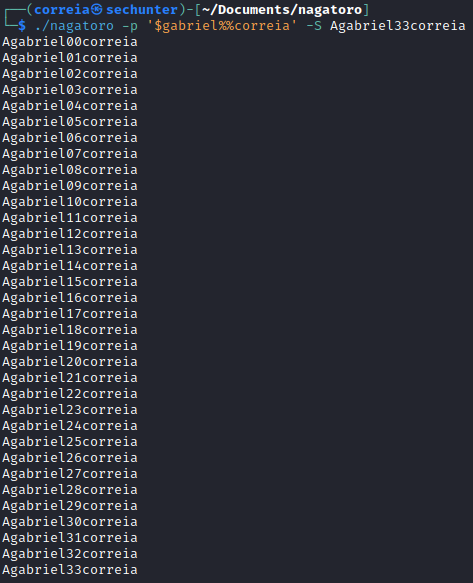

# nagatoro

A simple generator that's can parser a pattern for determine and create the wordslist

## How to build

~~~bash
nagatoro> make
~~~

## How to run

~~~bash
./nagatoro -p "%%somepattern$$$%%" -o wordlist-file
~~~
